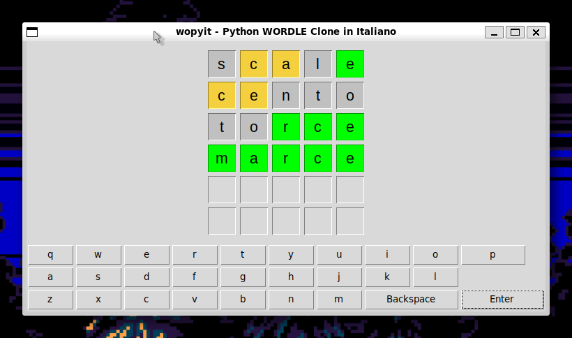

# wopyit
Python WORDLE Clone in Italiano (pronuncia *woo-peet*, *uopìt* all'italiana)

Una versione italiana realizzata a scopo didattico del gioco [WORDLE](https://www.nytimes.com/games/wordle/index.html).

Codice sorgente scritto usando unicamente librerie standard di python3 (tkinter per la GUI).
Dizionari presi da https://github.com/napolux/paroleitaliane.

### Come giocare

L'unico requisito è aver installato python3.x (lo sviluppo è stato testato su *WSL Ubuntu 24.04 con python3.12.3*).
Clonare la repository e lanciare il gioco con `python3 main.py`.

### Miglioramenti futuri

Il gioco è da considerarsi in **Beta**, ovvero funzionante ma non garantisco per eventuali bachi o comportamenti strani. Aprite pure una issue se volete proporre un fix o nuova feature. Le idee principalmente sono le seguenti:

- [ ] Cambio colori della tastiera (per rendere più semplice capire quali lettere non sono state ancora usate).
- [ ] Aggiungere pulsanti per reset / arrendersi.
- [ ] Aggiungere statistiche da conservare fra una partita e l'altra (sqlite possibile implementazione).
- [ ] Ampliamento dizionari.
- [ ] Miglioramenti grafici (Tastiera, temi, ecc).
- [ ] Varie ed eventuali.